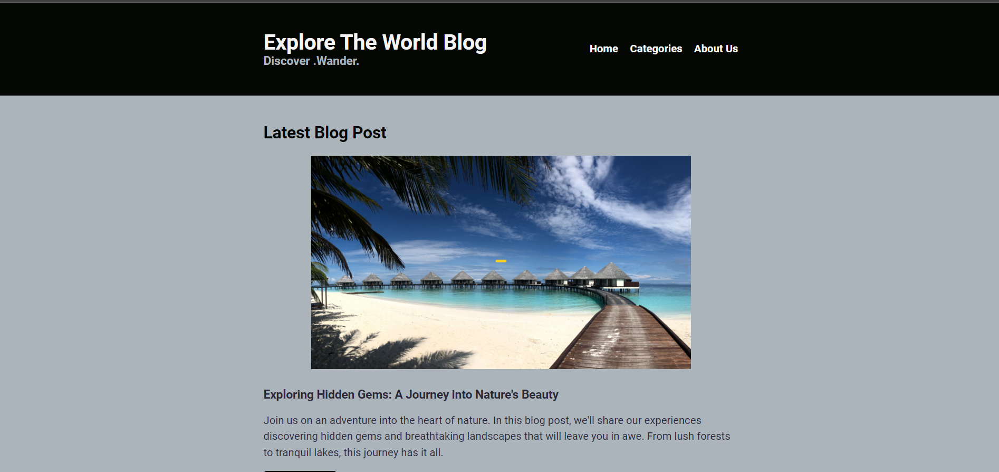

# Explore The World Blog.

## About the Project

This project, titled "Explore The World Blog," is a simple web application created to practice and improve responsive web design skills. It serves as a responsive blog website for travel enthusiasts and adventurers who want to explore captivating destinations worldwide.

**Title**: Explore The World Blog

**Subtitle**: Discover. Wander

The main goals of this project are:

- Create a visually appealing and user-friendly blog website.
- Implement responsive design principles to ensure optimal viewing on various devices, including desktops, tablets, and smartphones.

## Features

- **Responsive Design**: The website is designed to adapt to different screen sizes and devices, providing an optimal user experience.

- **Homepage**: The homepage features stunning images and an introduction to invite users to explore the blog.

- **Featured Blog Posts**: Engage visitors with featured blog posts, each showcasing a captivating destination. Each post includes images and descriptions to entice readers.

- **Navigation Menu**: The navigation menu allows users to easily access different sections of the blog, such as the homepage, destination pages, and the "About Us" section.

## Getting Started

Happy coding and happy exploring!
